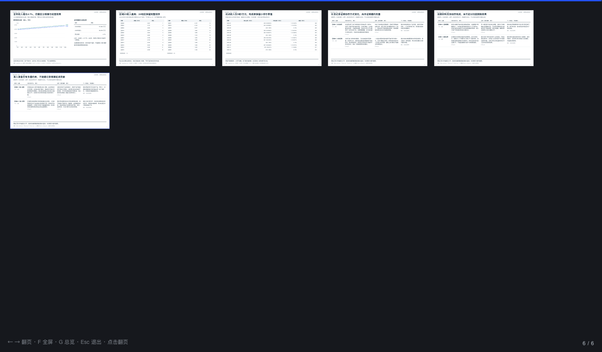
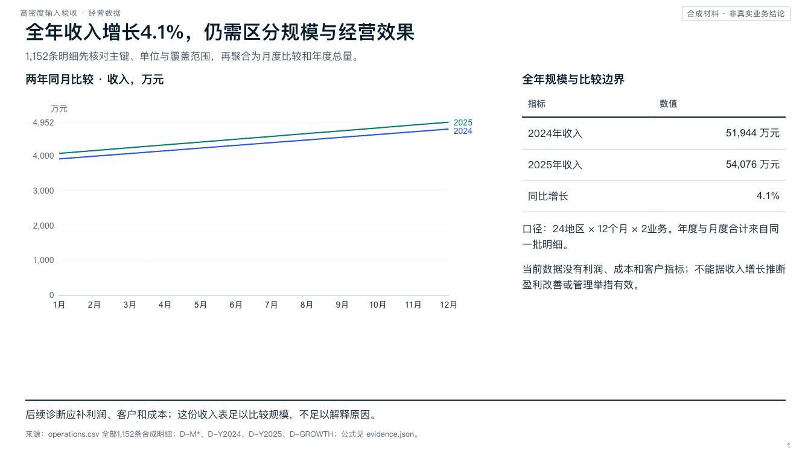
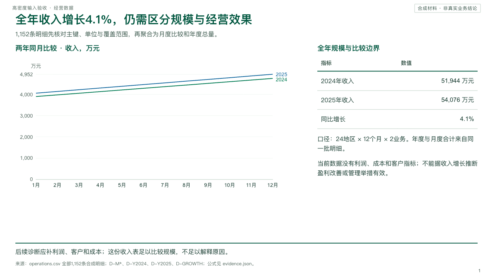
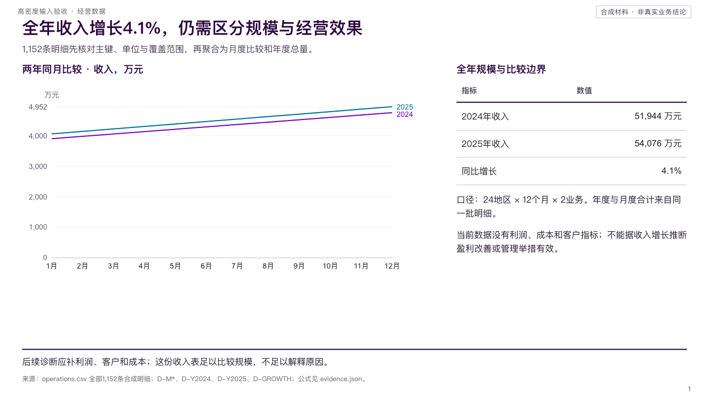

> 🌐 语言 · Language：[简体中文](README.md) · [English](README_EN.md)

# Consulting Deck Skill

**把一份简报，变成一份咨询级的演示文稿。**
*Turn a brief into a consulting-grade deck — as a single HTML file.*


`consulting_deck_skill` 是一个 Claude Code Agent Skill：你给它简报与原始材料，它走完 **分析 → 叙事 → 视觉 → 制作 → 独立质检** 全流程，交付**一个自包含 HTML 演示文稿**——16:9 或 4:3、翻页/缩放/全屏演示、URL 深链，浏览器打印即得逐页 PDF。



上图及三配色缩略图保留历史版式示例；v7字体效果见[字体对照样稿](iteration_v7_typography/comparison/serif-report.html)，技能内的两份HTML样稿已升级。

## 为什么是它

| 没有它的时候 | 有了它之后 |
|---|---|
| 内容、分析、排版、图表在多个工具之间来回搬运 | 一次简报，从分析到成品一条龙 |
| 图表凭感觉画，数字来源说不清 | 每个数字落到来源，待核缺口显式保留 |
| 交付 PPTX 要装 Office，字体、版式到处跑 | 单个 HTML 文件，浏览器即开即演示，可打印 PDF |

## 核心能力

- 🧭 **S0–S8 门禁制工作流** — 简报、资料、分析、叙事、视觉、制作、质检、交付八个阶段，每阶段有明确门禁，不通过不进入下一阶段。
- 🔬 **先分析，后表达** — 先建立问题、方法、实际结果与反证，再形成页面；覆盖商业/行业、战略/经营、财务、数据、叙事等分析场景的六类方法卡，支持 `analytical`（原始材料）/ `exploratory`（开放研究）/ `editorial`（已确认文稿）三档深度。
- 📊 **咨询级图表引擎** — ECharts 6.1.0 + 9 种标准配方（带输入校验与容量边界），10 种 SVG 分析组件 + HTML 比较表，瀑布、Mekko、完整表格回退一应俱全。
- 🎨 **三套内置主题** — McKinsey（默认）/ BCG / Accenture 风格，一次选择、持续继承，色值单一来源。
- 🔤 **统一字体系统** — 衬线主标题、无衬线正文与数据；中西文字重、图表测量、字体子集和PDF嵌入共同验收。构建依赖见 [字体说明](consulting_deck_skill/references/typography_system.md)，打开成稿无需安装字体。
- 🧾 **证据纪律** — 页面上每个数字必须来自用户素材或调研来源；仅真正合成数据标注 Illustrative，分析判断与建议分别标注。
- 🤖 **多 agent 协作** — 调研 2–3 并行、页面设计 2–4 并行、QA 独立 1 个，各司其职。
- 📦 **单文件交付，离线可读** — 交付物为单个 HTML；离线场景经静态 SVG 路径完整自包含，断网可读。
- ✅ **独立 QA** — 分析、证据、视觉、工程四类验收，逐页渲染与打印检查，Blocking/Major 问题清零才算通过。

## 效果：同一份内容，三套主题

| McKinsey（默认） | BCG | Accenture |
|---|---|---|
|  |  |  |

## 快速开始

### 1. 安装

```bash
cp -R consulting_deck_skill ~/.claude/skills/consulting_deck_skill
```

也可以软链关联，本仓库修改即时生效：

```bash
ln -s "$(pwd)/consulting_deck_skill" ~/.claude/skills/consulting_deck_skill
```

### 2. 使用

在 Claude Code 中输入 `/consulting_deck_skill`，按提示提供简报——受众、要做的决定、素材与截止日期。首次会询问主题，此后继承上次选择。

### 3. 先看样稿（零依赖）

```bash
open consulting_deck_skill/assets/reference_deck.html          # 9 页引擎样稿，断网完整可读
open consulting_deck_skill/assets/analysis_reference_deck.html # 6 页分析表达样稿
```

## 工作流程

```
S0 简报 ──→ S1 资料与问题 ──→ S2 分析规划/执行/审查 ──→ S3 storyline
──→ S4 视觉与分页 ──→ S5 页面规格 ──→ S6 制作 ──→ S7 独立 QA ──→ S8 交付
```

## 仓库里有什么

| 目录 | 是什么 |
|---|---|
| [`consulting_deck_skill/`](consulting_deck_skill/) | 技能本体：SKILL.md 主编排 + references 手册 + 引擎/组件 + 验证脚本 |
| [`report/`](report/) | 《咨询公司 Deck 制作手册 v2.0》：8.6 万字方法论调研 |
| [`research_notes/`](research_notes/) | 证据底稿：每条结论 = 断言 + 来源 URL + 置信度 |
| `task_bak/`、`iteration_v*/` | 任务简报与历代迭代记录、样稿与 QA 归档 |

## 质量保障

引擎与组件均有自动化验证：headless Chrome 三连测（DOM 完整性 / URL 深链 / 打印每页一张）、图表数据契约、主题对比度、SVG 数值编码；每次迭代独立 QA 并归档。工程细节见 [CLAUDE.md](CLAUDE.md) 与 [skill README](consulting_deck_skill/README.md)。

## 版本历程

- **v1** — 基础引擎与 S0–S8 工作流
- **v2** — 原创 SVG 组件、9 页样稿与浏览器验收脚本
- **v3** — 三套内置配色主题
- **v4** — 分析表达组件：差异注释、堆积图、比较表
- **v5** — 高密度可视化路由与 ECharts 6.1.0 标准配方
- **v6** — 分析规划、六类方法卡与论证综合
- **v7**（当前）— 统一字体角色、固定字体资源、离线子集、真实字形测量与字体QA

详见各 `iteration_v*/` 归档。

## 免责声明

三套主题是基于**公开视觉资料**的独立适配，并非任何咨询公司的官方内部模板。本仓库交付 HTML（可打印为 PDF），不冒称原生可编辑 PPTX。
