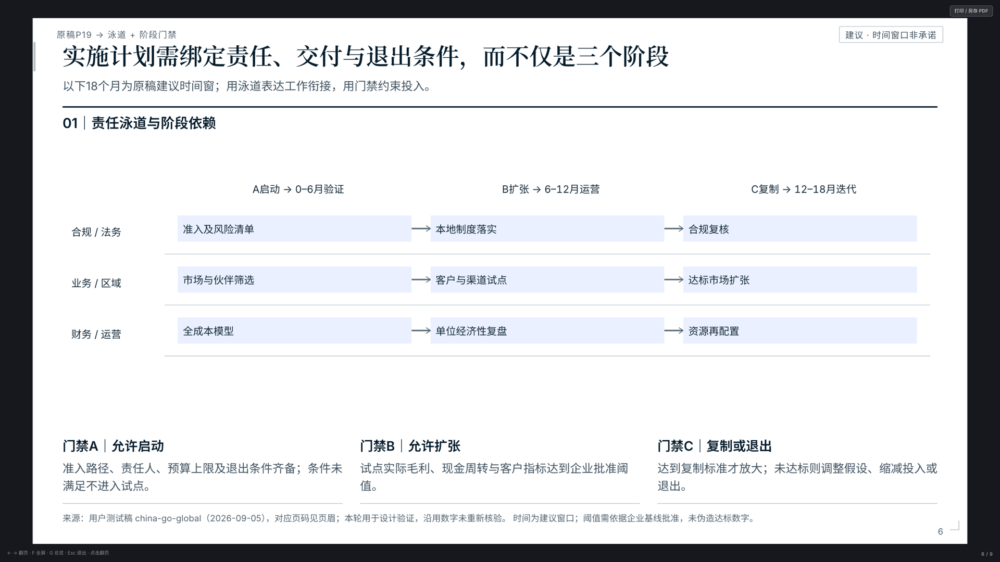
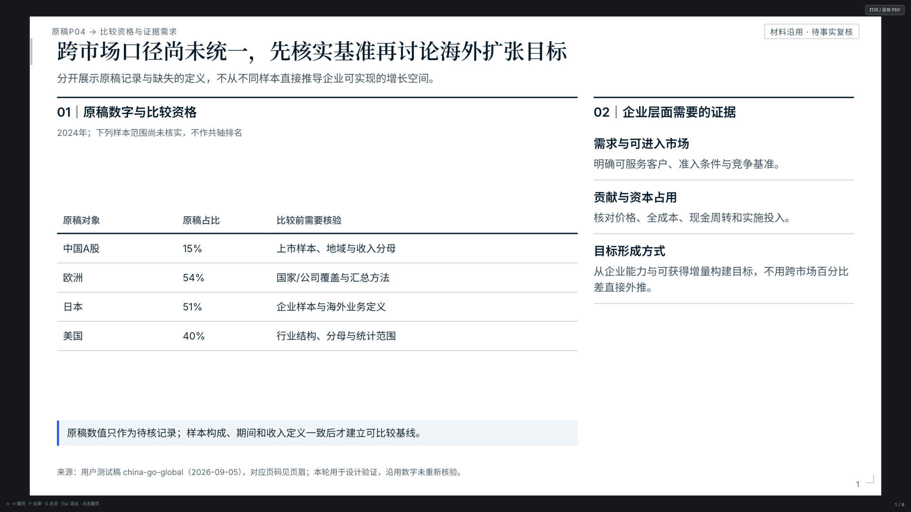
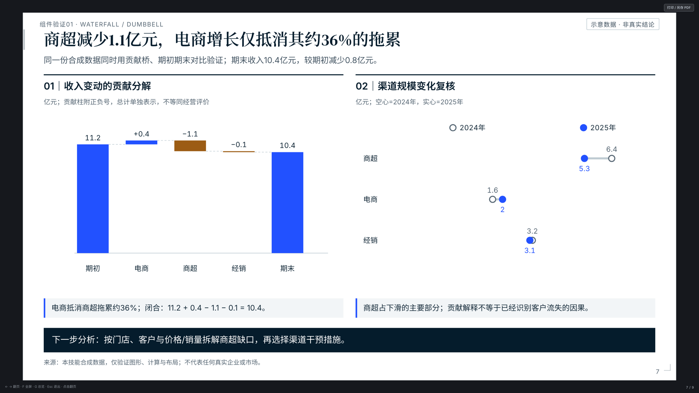
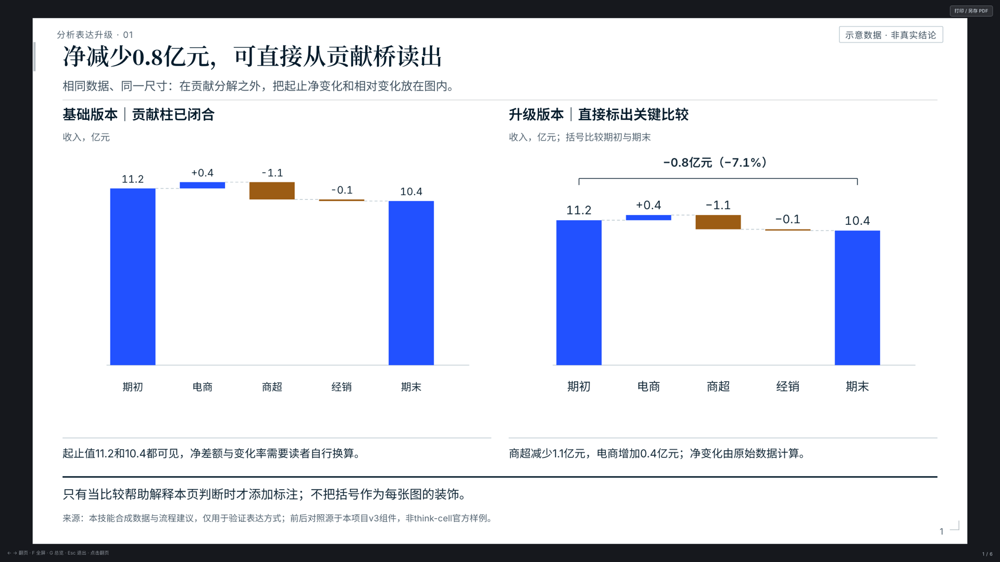

> 语言：[简体中文](README.md) · [English](README_EN.md)

# Consulting Deck Skill · V11.2

把简报和丰富的原始材料转成有依据、有判断、可阅读的咨询deck，交付自包含HTML与同版分页PDF。

`consulting_deck_skill`适用于支持Agent Skills的工具。以分析质量、论证和视觉设计共同决定成果；方法、图型与模板供模型选用，允许扩展和自定义。HTML支持翻页、缩放、全屏、深链和离线下载同版PDF。

V11.2将制作与验收统一到任务合同：提前触发分析复核与环境检查，禁止装饰边条模块，逐页检查视觉均衡与有效对齐；审查绑定实际HTML/PDF页面证据，关键限定核对最终PDF，符合条件的未变页可继承旧审查。实现与本轮验收状态见[V11.2记录](iteration_v11_2_contracts/validation.md)。

v9.3.1将McKinsey标题与主强调统一为`#000080`，辅助底色采用`#D9D9EC`，延续真实粗标题和按角色继承的正文层级。见[本轮验证与样稿](iteration_v9_3_1_navy/validation.md)。

v9.2在S4–S5按需调用独立的`echarts-viz-planner`选型模块；主技能仍统筹分析、数据和成稿。只安装主技能也能按需加载随包依赖快照，支持离线。见 [协作与加载](consulting_deck_skill/references/viz_planner_integration.md) 和 [实施验证](iteration_v9_2_viz_planner/validation.md)。沿用v9.1的低对比中性母版。

V10补齐完整报告的封面、单页参考资料与封底；首尾标题采用深墨色，正文沿用既有角色。来源超量时显式节选，保留完整追溯；新检查按页面职责启用，旧稿与组件集合保持兼容。见 [首尾页规则](consulting_deck_skill/references/report_bookends.md)、[完整五页样稿](consulting_deck_skill/assets/bookends_example.html) 和 [V10验证](iteration_v10_bookends/validation.md)。

## 样稿速览

以下为保留的历史正文与组件样稿（v9.1 母版；其中旧装饰边条不再是新稿允许样式），浏览器直接打开，支持翻页、缩放、全屏与深链；点图直达对应页面。

[](consulting_deck_skill/assets/reference_deck.html#6)

| [](consulting_deck_skill/assets/reference_deck.html#1) | [](consulting_deck_skill/assets/reference_deck.html#7) | [](consulting_deck_skill/assets/analysis_reference_deck.html#1) |
|---|---|---|
| 有判断的封面与证据台账 | 地区规模 × 产品构成 | 贡献桥与差异注释 |

完整资源：[9页设计与组件样稿](consulting_deck_skill/assets/reference_deck.html) · [6页分析表达样稿](consulting_deck_skill/assets/analysis_reference_deck.html)。样稿内数据仅用于展示版式与组件，不是本轮重新验证的行业研究。

## v9：更多创作空间，更直接的质量判断

- **开放分析**：按业务问题选用经典方法或透明的自定义分析，处理明细数据、访谈、文献及混合材料。框架输出要形成发现和取舍。
- **丰富视觉**：9种ECharts标准配方、10种SVG分析组件和HTML比较表，补充节点／边／分组图示；原生/custom ECharts、自由SVG等路线均可直接使用。
- **减少流程负担**：S0–S8可合并迭代；固定模板、候选数量、编号齐全、逐页评分都不作为普遍条件。复杂项目才展开详细规格与独立审查。
- **按成果验收**：字体与标题建议可调整。关键事实、计算、几何编码、可读性、打印完整性及版本一致性需要成立。
- **保留可靠交付**：三套配色、统一字体资源、自包含HTML和同版PDF；正式打包绑定真实复核记录，未完成审查用预览状态。

## 使用

将技能目录复制或软链到所用工具的技能目录，例如：

```bash
ln -s "$(pwd)/consulting_deck_skill" ~/.codex/skills/consulting_deck_skill
```

调用`consulting-deck-skill`并提供受众、需回答的问题、原材料和约束。支持analytical（原始材料）、exploratory（开放研究）和editorial（已确认文稿）；已有主题与字体偏好持续继承。无需预先指定页数、图型数量或框架清单。

复制完整`consulting_deck_skill`目录，包括`dependencies/`。无需另装planner：加载器优先复用本地兼容版本，缺失则解包经过内容校验的快照；模型直接读取返回的技能路径。源码在[独立仓库](https://github.com/ZeroxZhang/echarts-viz-planner)维护，快照作为主技能分发产物生成。

构建环境、渲染命令和交付说明见 [skill README](consulting_deck_skill/README.md)。成稿打开无需构建依赖。

## 项目入口

| 内容 | 位置 |
|---|---|
| 技能主流程 | [SKILL.md](consulting_deck_skill/SKILL.md) |
| 开放规则与检查范围 | [open_authoring.md](consulting_deck_skill/references/open_authoring.md) |
| 经典分析扩展 | [framework_extensions.md](consulting_deck_skill/references/framework_extensions.md) |
| 图示与自定义图表 | [custom_exhibits.md](consulting_deck_skill/references/custom_exhibits.md) |
| 本轮实施与实际验证 | [V11.2验证记录](iteration_v11_2_contracts/validation.md) |
| 上轮对抗式审查 | [审查报告](review_partner_2026-09-06/review_report.md) |
| 当前项目规则 | [AGENTS.md](AGENTS.md) |

三套主题为McKinsey、BCG、Accenture公开视觉资料的独立适配，并非官方内部模板。项目聚焦HTML＋PDF。组件回归和单个案例验证各有范围，不以测试通过承诺任意项目都达到顶级咨询成果。

历代归档：v1引擎与工作流；v2 SVG与样稿；v3主题；v4分析展品；v5高密度路由；v6分析规划；v7字体；v8双格式交付；v9开放分析与创作、按影响验证。`report/`与`research_notes/`保留历史方法论研究。
