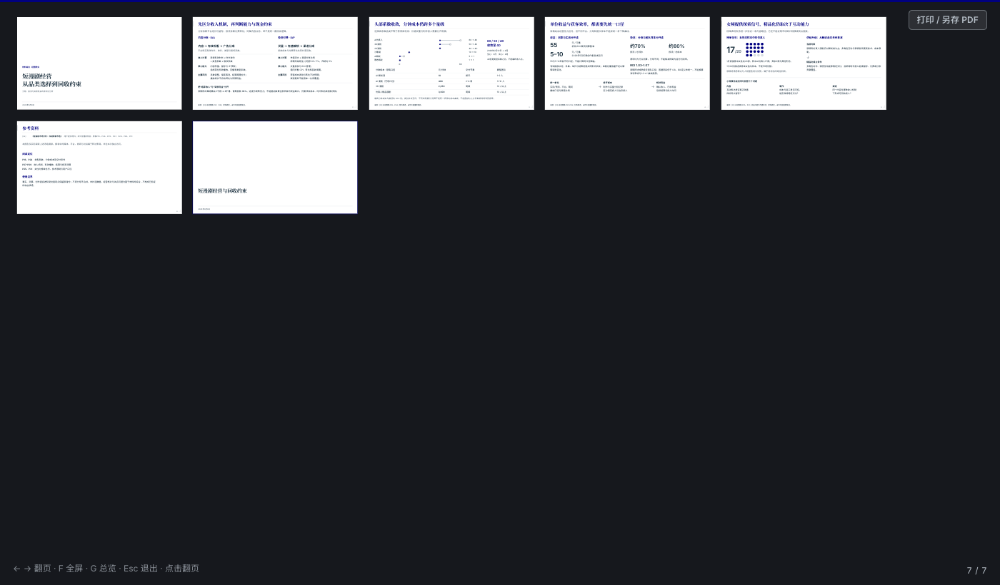
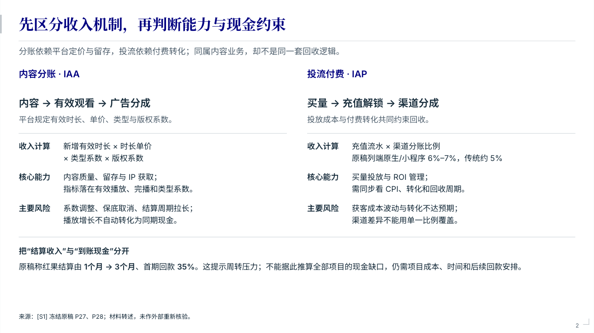
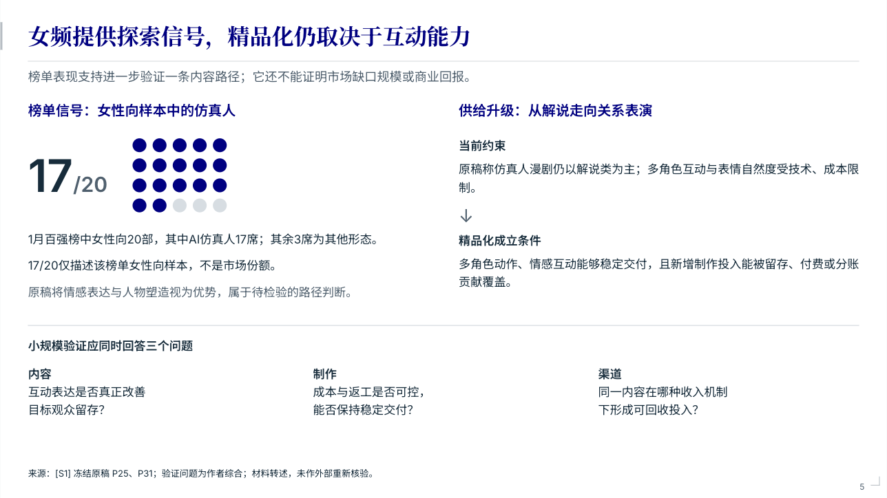
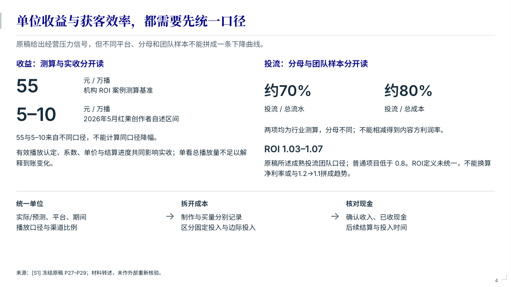
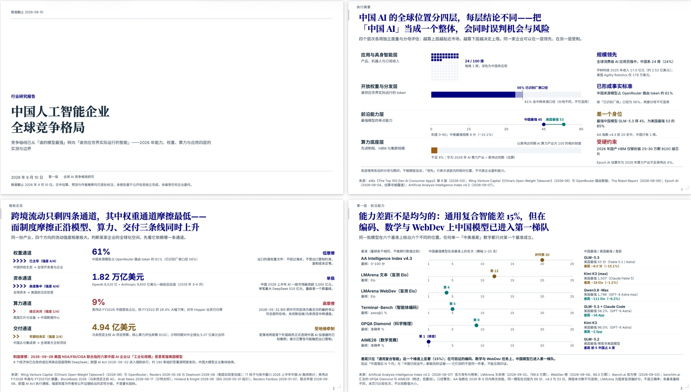
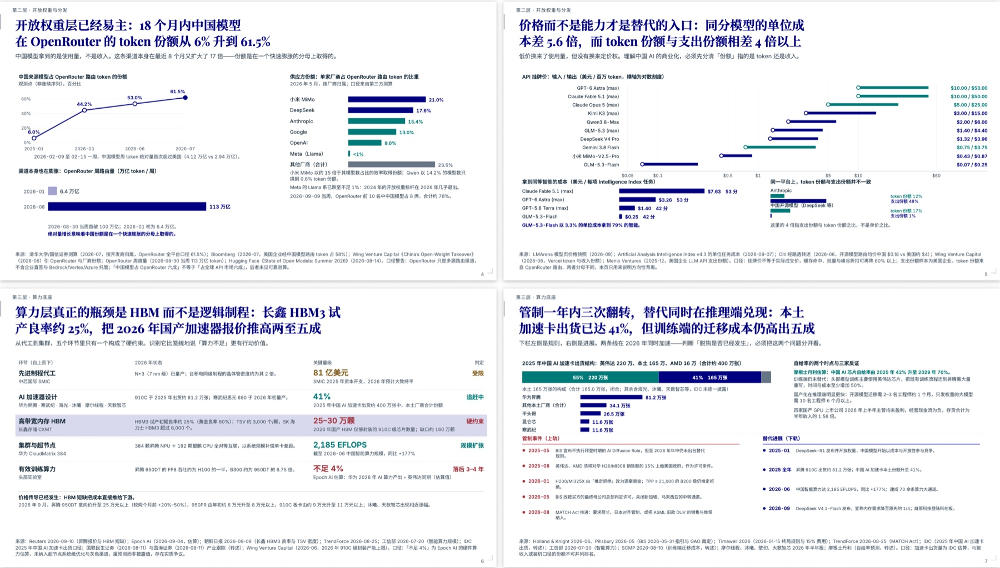
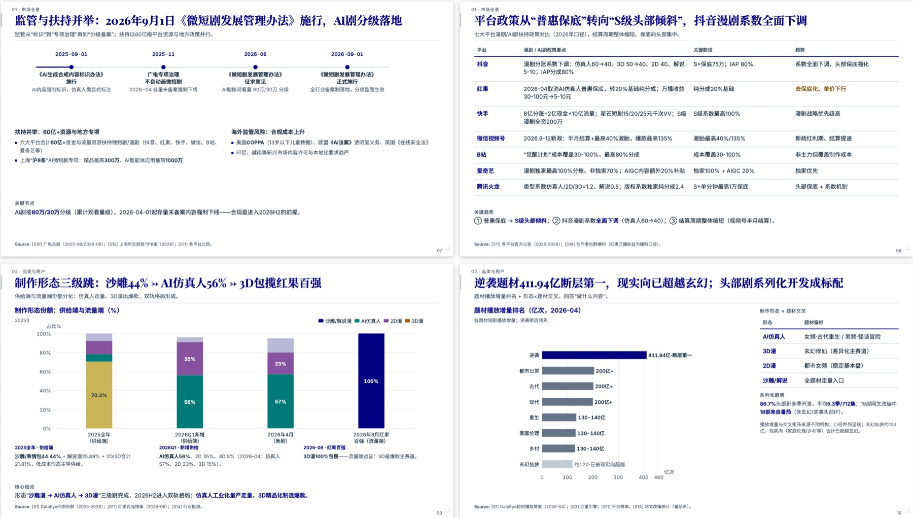
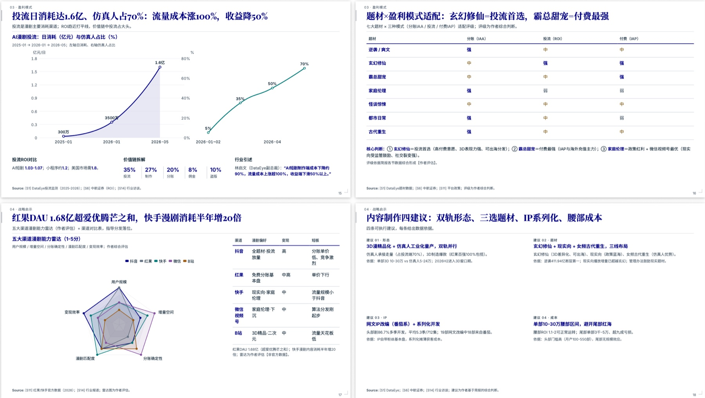

# Consulting Deck Skill · Concise

**把一堆原始材料，变成一份能直接拿去见客户的咨询报告。**

给它财报、访谈、行业资料、一份写得还不清楚的初稿——它会先做分析，再把结论组织成有主线、有图表、有依据的整册报告，最后交付一份能翻页的 HTML 和一份同版的 PDF。

[](../docs/showcase/report-page-mechanism.png)

## 你会拿到什么

一份**自包含的报告**：单个 HTML 文件，双击就能看，支持翻页、缩放、全屏、深链，并内嵌一键下载的同版 PDF——离线、断网、发给别人都不掉东西。

它不是"帮你把要点排成几页幻灯片"。它是**先把问题想清楚，再决定长什么样**：

| | |
|---|---|
|  |  |
| 两条业务线的机制、能力与风险逐项对照，结论落在同一张画布上 | 大数字配点阵直接给出样本信号，右侧展开它的成立条件 |
|  | |
| 两组数字来自不同分母，就分开呈现，不拼成一条假的下降曲线 | |

## 样例

下面四份成稿，各取连读的四页。**题材、图表形态和页数都由要回答的问题决定**——同一套流程既做算力与模型的竞争格局，也做内容行业的政策与盈利结构。

| | |
|---|---|
|  |  |
| 《中国人工智能企业全球竞争格局》：封面、执行摘要、四层格局总览与前沿能力对比 | 同一主题的展开页：开放权重的 token 份额、同分模型的价格差、HBM 良率瓶颈与管制变化 |
|  |  |
| 《微短剧与 AI 剧行业趋势》：监管时间轴、七大平台政策对比、制作形态三级跳与题材播放增量 | 《漫剧行业研究》：投流日消耗与价值链拆解、题材 × 盈利模式适配、渠道能力对比与制作建议 |

四页连看能看出这套流程的三个习惯：标题本身就是结论，图表承担证据，口径与限制写在页面上，而不是藏进附注。

## 它和"让 AI 画几张图"的区别

**先分析，再表达。** 材料先按明细、分布和口径读懂，围绕问题做真正的计算、比较和机制推理；不是把输入压成几条摘要再配图。贡献不等于因果、样本不等于市场、口径不同不能强比——这些判断写进了流程。

**标题说了什么，图上就得看得见。** 标题声称有"链条、差异、条件"，读者要能在展品里找到对应结构，而不是只在正文里读到。收短模块后必须回到整页重新分配空间，不允许自然高度贴顶就交稿。

**亲眼看过才算完成。** 每页 HTML 截图和最终 PDF 都会被逐页查看并给出具体判断。工具不能看图时如实写"未验收"，不允许用自动检查通过代替。

**关键限制不会被悄悄丢掉。** 分母、期间、否定条件、事实与预测的身份会绑定到页面上的真实对象，并核对它们是否真的出现在最终 PDF 里。

## 适合谁

- 需要**行业研究、战略汇报、经营诊断、投资判断**的咨询、投资、战略与业务分析工作
- 手上材料很多（表格、访谈、报道、财务数据），但**没时间也没把握把它组织成有说服力的报告**
- 已经有一份写好的文稿，需要**变成专业排版的交付物**，而不重写内容

## 开始之前：用时和消耗

一次完整制稿要走完**调研 → 分析 → 逐页创作 → 实现 → 装配 → 逐页看图验收 → 独立复核**，其中“逐页截图验收”和“独立复核”是硬流程，不能跳过，也不能用自动检查通过来代替。请先知道：

- **预计用时 1–2 小时**，随任务量浮动：材料和页数越多、复核越重就越久；已有成稿的再排版、单页返修会明显更快。
- **Token 消耗明显大于普通问答**：材料要按明细读，每一页要单独创作并看图验收，还有一轮独立复核——这是质量和质检的代价。
- 动手前技能会先把这些讲清楚并**等你确认**，你不点头它不会开始。

## 怎么用

把技能目录装到你的 Agent 工具的技能目录里（支持 Agent Skills 的工具都可以），然后**像跟人交代工作一样说清楚三件事**：

1. **给谁看、要回答什么问题**（受众和决策）
2. **手上有什么材料**（文件、链接、数据）
3. **有什么硬要求**（页数、风格、必须出现或必须避开的说法）

不需要预先指定页数、图型数量或要套哪个框架——这些由问题决定。已有偏好（配色、字体、风格）会被继承。

### 这样说，效果最好

> 下周三要给消费基金的投委会讲一份材料，回答一个问题：这个品牌 2025 年增长放缓，是渠道问题还是品牌力问题。材料在 `./data`：三年分季度财报、六个城市的门店走访记录、两份行业报道。结论要能支撑“继续投还是退出”的判断。硬要求：第一页放结论摘要，所有销售额注明口径。

> 把这份已经写好的复盘（`草案.md`）做成能直接发团队的正式报告。内容和结论不要改，只重组表达和排版。受众是业务线负责人，重点是三个季度里做对和做错的选择，20 页以内。

> 我想做一份国内宠物食品行业的开放研究：先摸清行业规模和竞争格局，再看有没有值得下注的细分。我手上没有材料，需要你去查。

共同点是：**说清谁看、要回答什么、材料在哪、什么不能妥协**，其余交给技能判断。

### 这样说，效果会差

| 这样说 | 会发生什么 |
|---|---|
| “帮我做个 PPT” | 没有受众、问题和材料，技能得先反问一轮，方向也容易做偏 |
| “做 30 页，每页都要有图” | 页数和图型应由问题决定；写死后分析容易被挤成凑数 |
| “数据你随便编一点” | 技能不补造数据，只会如实降低结论强度，不会把数字填满 |
| “输出 PPTX” | 交付形态是 HTML + 同版 PDF，不产出 PPTX |

### 材料给得越原始，报告越好

材料是按**明细、分布、口径**读的。给原始表格、访谈全文、完整财报，分析就能落到真实计算和机制推理上；只给几条摘要，报告也只能停在摘要层面。材料不完整时，说清“哪些是事实、哪些是估计、哪些不知道”，比给一个漂亮的结论更有用。

三种材料状态都支持：**原始材料**（做完整分析）、**开放研究**（先探索再收敛）、**已确认文稿**（保留事实与结论，只重组表达，不补造数据）。

## 建议用什么模型

这个技能对模型能力的要求高于一般生成任务，**建议用多模态的 SOTA 模型**：

- **多模态（能读图）**：验收环节要求逐页查看 HTML 截图和最终 PDF，并对每页给出具体判断——主证据是否先被看见、标题里的关系是否真的展开、留白与对齐是否成立。模型不能看图时，技能只能如实写“未验收”，视觉质量就没人真正把关。**能读图是拿到合格成品的前提。**
- **SOTA（当前最强的一档）**：技能同时吃深度分析、长材料理解、整页视觉设计和严格契约遵循；能力不足的模型容易在分析取舍、整页配平和自查复核上掉档。换更强的模型，成品质量与质检强度差别很明显。

## 它坚持的几条底线

默认 McKinsey 藏青主题，另备 BCG、Accenture 两套独立适配的视觉方案（来自公开资料的独立设计，**不是任何公司的官方模板**）。深度研究用 reading 模式，现场讲述用 presentation 模式。

报告里不会出现装饰性色条、虚假精确的图表、被截断隐藏的坐标轴，或为填满页面而拉高的空块。图上每个数字都能追回来源。

## 边界

- 交付形态是 **HTML + 同版 PDF**，不产出 PPTX。
- 它做的是**分析与表达**，不替代外部事实核验——原始材料的身份（事实／测算／受访者观点）会被如实保留。
- 自动检查提供工程证据，不能替代商业判断。文案里的"通过"只代表它检查过的范围。

## 安装与运行

构建需要 Node 18+、Chrome、Playwright、Poppler（pdfinfo/pdffonts/pdftotext）与 Python 3 字体依赖；**成稿在浏览器打开不需要这些**。

构建链路在 macOS 与 Linux 上验证。**Windows 未验证**：`setup_font_venv.sh` 是 POSIX shell，且按 `venv/bin/python` 的路径写，Poppler 也要另行安装。请走 WSL；或自行准备 fontTools，再用 `FONT_PYTHON` 指向解释器。

```bash
npm ci            # 装配、QA、PDF 导出、几何审计所需的 Node 依赖
npm run setup-fonts   # 建 .font-venv 并装 fontTools（仅构建字体子集需要）
```

`scripts/setup_font_venv.sh` 只往技能的 `.font-venv` 里装依赖，不写系统 Python（PEP 668 环境也适用）。装好后 `pack_fonts.cjs` 与 `probe_capabilities.cjs` 会自动找到它，**不需要再导出 `FONT_PYTHON`**；要从别处指定解释器时该变量仍然优先。不想建 venv 也可以自行准备 fontTools，再用 `FONT_PYTHON` 指向它。脚本也能直接用在 uv 等工具建的 venv 上：那类 venv 默认不带 pip，脚本会用 ensurepip 自己引导，所以日志里出现“无 pip，用 ensurepip 引导”属正常，不是报错。

Chrome 走 Playwright 的 `channel: 'chrome'`，需要本机已装 Chrome；用别的浏览器或既有 Playwright 模块时按 [交付契约](references/delivery.md)设 `CHROME_CHANNEL` / `PLAYWRIGHT_MODULE`。

装完先跑一次能力自检，确认最小渲染、字体与真实 PDF 路径都可用：

```bash
node scripts/probe_capabilities.cjs /tmp/deck-probe
```

制稿流程由 Agent 按 [SKILL.md](SKILL.md) 执行；任务合同字段、交付门禁与审查契约见[交付契约](references/delivery.md)。技能内部按需加载 11 份说明文件，入口见 [SKILL.md](SKILL.md)。

```bash
node scripts/assemble_deck.cjs /任务/pages.html /任务/deck.html --css /任务/page.css --title "报告标题" --contract /任务/task.json
node scripts/qa_deck.cjs /任务/deck.html /任务/renders
node scripts/aggregate_reviews.cjs /任务/renders/audit.json /任务/renders/review.json /任务/renders/author.json /任务/renders/independent.json
node scripts/package_delivery.cjs /任务/deck.html /任务/renders/deck.pdf /任务/delivery 报告名
```

选型可接入独立的 [echarts-viz-planner](https://github.com/ZeroxZhang/echarts-viz-planner)；随包已带可离线使用的快照，不装也能跑。维护与回归入口（`test_*`、`sync_*`、`build_*`）不是制稿必需。

---

本页展示的报告内容为演示材料，来源与身份在页面内标注。三套主题为公开视觉资料的独立适配，并非官方内部模板。
